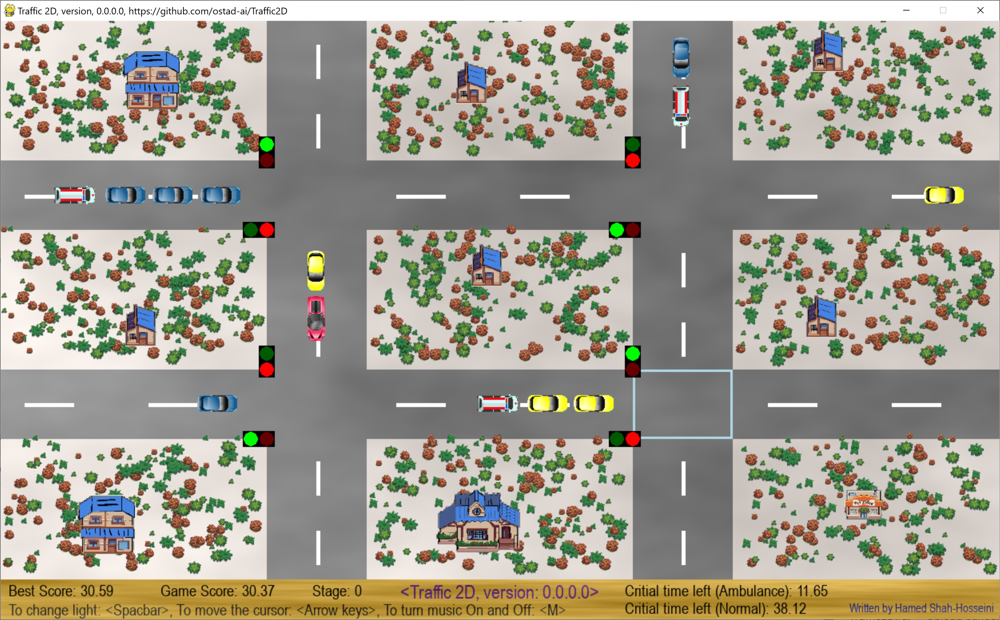

# Traffic2D
This is a 2D traffic game in which you control the traffic lights here to avoid heavy traffic. 
### First version: version 0.0.0.0
1. Use **Arrow keys** to move the cursor.
2. To change the state of traffic lights, you click on the **SpaceBar** key.
3. Background music is also included, which you can turn it ON or OFF by key **M**.
4. Here, an **ambulance** has **20** seconds to pass, while all the **other vehicles** have **40** seconds each to pass. You have to let them pass before the mentioned times.
## This archive includes the executable program: **traffic2d.exe**, which is suitable for **Windows 10** and over. You should click on the executable to run.
[Download the archive for win64](https://drive.google.com/file/d/1qK7DLRCY-zlfXaV0sGGbWPtLU_L8ooWr/view?usp=sharing)
---
 *Figure 1: A snapshot of Traffic2D Game, version 0.0.0.0, while playing the game.*
---
